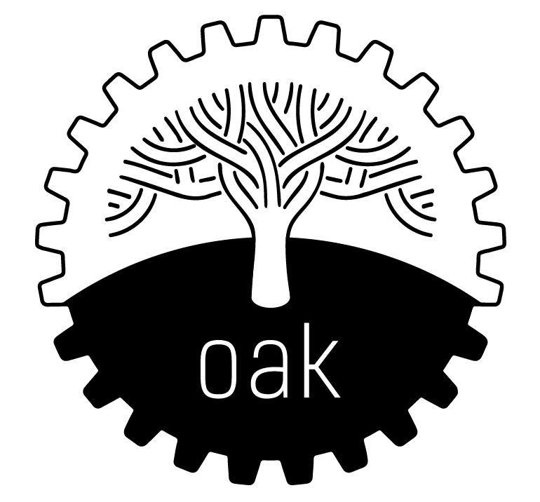

# Ontology Access Kit (OAK)

Python lib for common ontology operations over a variety of backends.



[](https://badge.fury.io/py/oaklib)

[](https://mybinder.org/v2/gh/incatools/ontology-access-kit/main?filepath=notebooks)
[](https://pepy.tech/project/oaklib)
[](https://doi.org/10.5281/zenodo.6456239)
[](.github/CODE_OF_CONDUCT.md) 

OAK provides a collection of [interfaces](https://incatools.github.io/ontology-access-kit/packages/interfaces/index.html#interfaces) for various ontology operations, including:

 - [look up basic features](https://incatools.github.io/ontology-access-kit/guide/basics.html) of an ontology element, such as its label, definition, relationships, or aliases
 - search an ontology for a term
 - validate an ontology
 - modify or delete terms
 - generate and visualize subgraphs
 - identify lexical matches and export as SSSOM mapping tables
 - perform more advanced operations, such as graph traversal, OWL axiom processing, or text annotation

These interfaces are *separated* from any particular backend, for which there a number of different [adapters](https://incatools.github.io/ontology-access-kit/implementations/index.html).
This means the same Python API and command line can be used regardless of whether the ontology:

 - is served by a remote API such as OLS or BioPortal
 - is present locally on the filesystem in owl, obo, obojson, or sqlite formats
 - is to be downloaded from a remote repository such as the OBO library
 - is queried from a remote database, including SPARQL endpoints (Ontobee/Ubergraph), A SQL database, a Solr/ES endpoint

## Documentation:

- [incatools.github.io/ontology-access-kit](https://incatools.github.io/ontology-access-kit)
- Presentations:
   - [Using the OAK command line](https://doi.org/10.5281/zenodo.7708962) *OBO Academy 2023*
   - [Introduction to OAK](https://doi.org/10.5281/zenodo.7765088) *OAK workshop 2022*

## Contributing

See the contribution guidelines at [CONTRIBUTING.md](.github/CONTRIBUTING.md).
All contributors are expected to uphold our [Code of Conduct](.github/CODE_OF_CONDUCT.md).

## Usage

```python
from oaklib import get_adapter

# connect to the CL sqlite database adapter
# (will first download if not already downloaded)
adapter = get_adapter("sqlite:obo:cl")

NEURON = "CL:0000540"

print('## Basic info')
print(f'ID: {NEURON}')
print(f'Label: {adapter.label(NEURON)}')

for alias in adapter.entity_aliases(NEURON):
    print(f'Alias: {alias}')

print('## Relationships (direct)')
for relationship in adapter.relationships([NEURON]):
    print(f' * {relationship.predicate} -> {relationship.object} "{adapter.label(relationship.object)}"')
    
print('## Ancestors (over IS_A and PART_OF)')
from oaklib.datamodels.vocabulary import IS_A, PART_OF
from oaklib.interfaces import OboGraphInterface

if not isinstance(adapter, OboGraphInterface):
    raise ValueError('This adapter does not support graph operations')

for ancestor in adapter.ancestors(NEURON, predicates=[IS_A, PART_OF]):
    print(f' * ANCESTOR: "{adapter.label(ancestor)}"')
```

For more examples, see

- [demo notebook](https://github.com/incatools/ontology-access-kit/blob/main/notebooks/basic-demo.ipynb)
- [tutorial part 2](https://incatools.github.io/ontology-access-kit/intro/tutorial02.html)

## Command Line

See:

 - [CLI docs](https://incatools.github.io/ontology-access-kit/cli.html)
 - [Example notebooks](https://github.com/INCATools/ontology-access-kit/tree/main/notebooks/Commands)

## Search

Use the pronto backend to fetch and parse an ontology from the OBO library, then use the `search` command

```bash
runoak -i obolibrary:pato.obo search osmol 
```

Returns:

```
PATO:0001655 ! osmolarity
PATO:0001656 ! decreased osmolarity
PATO:0001657 ! increased osmolarity
PATO:0002027 ! osmolality
PATO:0002028 ! decreased osmolality
PATO:0002029 ! increased osmolality
PATO:0045034 ! normal osmolality
PATO:0045035 ! normal osmolarity
```

### QC and Validation

Perform validation on PR using sqlite/rdftab instance:

```bash
runoak -i sqlite:../semantic-sql/db/pr.db validate
```

### List all terms

List all terms obolibrary has for mondo

```bash
runoak -i obolibrary:mondo.obo terms 
```

### Lexical index

Make a lexical index of all terms in Mondo:

```bash
runoak  -i obolibrary:mondo.obo lexmatch -L mondo.index.yaml
```

### Search

Searching over OBO using ontobee:

```bash
runoak  -i ontobee: search tentacle
```

yields:

```
http://purl.obolibrary.org/obo/CEPH_0000256 ! tentacle
http://purl.obolibrary.org/obo/CEPH_0000257 ! tentacle absence
http://purl.obolibrary.org/obo/CEPH_0000258 ! tentacle pad
...
```

Searching over a broader set of ontologies in bioportal (requires API KEY)
(https://www.bioontology.org/wiki/BioPortal_Help#Getting_an_API_key)

```bash
runoak set-apikey bioportal YOUR-KEY-HERE
runoak  -i bioportal: search tentacle
```

yields:

```
BTO:0001357 ! tentacle
http://purl.jp/bio/4/id/200906071014668510 ! tentacle
CEPH:0000256 ! tentacle
http://www.projecthalo.com/aura#Tentacle ! Tentacle
CEPH:0000256 ! tentacle
...
```
Alternatively, you can add "BIOPORTAL_API_KEY" to your environment variables.

Searching over more limited set of ontologies in Ubergraph:

```bash
runoak -v -i ubergraph: search tentacle
```

yields
```
UBERON:0013206 ! nasal tentacle
```

### Annotating Texts

```bash
runoak  -i bioportal: annotate neuron from CA4 region of hippocampus of mouse
```

yields:

```yaml
object_id: CL:0000540
object_label: neuron
object_source: https://data.bioontology.org/ontologies/NIFDYS
match_type: PREF
subject_start: 1
subject_end: 6
subject_label: NEURON

object_id: http://www.co-ode.org/ontologies/galen#Neuron
object_label: Neuron
object_source: https://data.bioontology.org/ontologies/GALEN
match_type: PREF
subject_start: 1
subject_end: 6
subject_label: NEURON

...
```

### Mapping

Create a SSSOM mapping file for a set of ontologies:

```bash
robot merge -I http://purl.obolibrary.org/obo/hp.owl -I http://purl.obolibrary.org/obo/mp.owl convert --check false -o hp-mp.obo
runoak lexmatch -i hp-mp.obo -o hp-mp.sssom.tsv
```


### Visualization of ancestor graphs

Use the sqlite backend to visualize graph up from 'vacuole' using test ontology sqlite:

```bash
runoak -i sqlite:tests/input/go-nucleus.db  viz GO:0005773
```


Same using ubergraph, restricting to is-a and part-of

```bash
runoak -i ubergraph:  viz GO:0005773 -p i,BFO:0000050
```

Same using pronto, fetching ontology from obolibrary

```bash
runoak -i obolibrary:go.obo  viz GO:0005773
```

## Configuration

OAK uses [`pystow`](https://github.com/cthoyt/pystow) for caching. By default,
this goes inside `~/.data/`, but can be configured following
[these instructions](https://github.com/cthoyt/pystow#%EF%B8%8F%EF%B8%8F-configuration).
