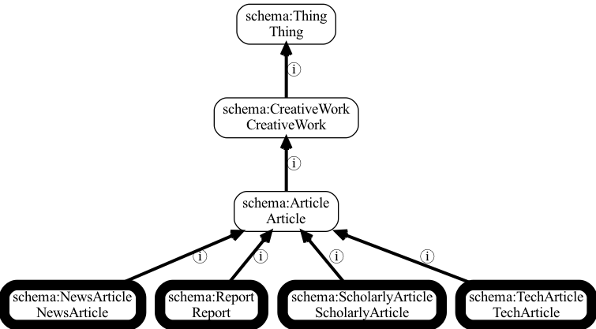

.. _basics:

OAK Basics
==========

OAK is a library for accessing and working with ontologies, controlled vocabularies,
and terminologies.

OAK is written in Python, and can be used in Python programs, or from the command line.
Command line use doesn't require any programming experience or programming knowledge, but
some knowledge of the command line is helpful.

If you are looking for a quickstart guide to command line interfaces in general,
see the `Command line short intro <https://oboacademy.github.io/obook/tutorial/intro-cli-1/>`_.

What is an ontology and why would I want to access one?
-------------------------------------------------------

Ontologies, controlled vocabularies, terminologies, and taxonomies are all ways of
organizing information and knowledge. Although OAK standards for Ontology Access Kit,
we use the term "ontology" to refer to any of these types of knowledge organization.

An ontology typically consists of a set of terms (also known as concepts, or classes) that
serve as descriptors. For example, the `Environment Ontology <http://obofoundry.org/ontology/envo>`_
consists of classes representing different environments or environmental features, such as
glaciers, lakes, and oceans.

These terms are often hierarchically organized, and may include other kinds of hierarchical information.

   Example of a part of a vocabulary: schema.org article types.

   This example shows a small example of the portion of schema.org with some
   types of article. The vocabulary is organized in a hierarchy, with hierarchical
   relationships shown where ⓘ denotes an is-a relationship. Note that although
   schema.org is more of a vocabulary than an ontology, you can use OAK to access it.
   This example was drawn using the OAK "viz" command.

Ontologies are used for many different tasks, but one of the most common ones is to annotate
or "tag" pieces of data or data elements. For example, schema.org can be used to tag web pages,
the `Human Phenotype Ontology <http://obofoundry.org/ontology/hp>`_ is
used to annotate individual patients with a set of phenotypic features. In more formal ontology
systems, the classes in an ontology are used to type instances or individuals. And
in fact, an ontology can contain individuals too.

Ontologies may also include rich lexical information or other metadata. These include
textual definitions, to help guide curators or users of the ontology, or aliases to help
guide search.

.. note::

    For more information on ontologies, see the `Introduction to Ontologies <https://oboacademy.github.io/obook/explanation/intro-to-ontologies/>`_
    in the `OBO Academy Book <https://oboacademy.github.io/obook/>`_.

Ontology languages, standards, and formats
------------------------------------------

The Web Ontology Language (OWL) is a standard for modeling ontologies. OWL is not a format
in itself, but it has a number of different serializations, including RDF/XML, RDF/turtle, functional syntax,
and manchester syntax.

It is not necessary to understand OWL to use OAK for many tasks. In fact, OWL is not the
only way in which ontologies and vocabularies are represented.

- Many biological ontologies have historically used `OBO-Format <https://owlcollab.github.io/oboformat/doc/obo-syntax.html>`_, a simple text format. OBO-Format is mapped to and defined in terms of OWL.
- A lot of terminologies and thesauri are represented in SKOS, a standard for representing controlled vocabularies.
- Some vocabularies such as schema.org use a lightweight RDF Schema representation.

OAK is able to read (and in some cases write) ontologies in all of these formats. Different
:ref:`implementations` handle different formats and backends. You can use :ref:`selectors` to choose
which implementation to use (alternatively, this is done automatically based on the file extension).

For example, on the command line, to list all terms a downloaded OBO Format file of the Human Phenotype Ontology:

.. code-block:: shell

   runoak -i hp.obo terms

Even when ontologies are represented in OWL, it doesn't mean that everything is standardized.
Two OWL ontologies could choose to indicate primary labels, synonyms, mappings, and definitions in
different ways. OAK attempts to provide a common layer on top of all these variants.
See further sections of this guide for more details on how this is done.

.. note::

    For more information on OWL and other ontology languages, see the
    `section on OWL <https://oboacademy.github.io/obook/explanation/owl-format-variants/>`_
    in the `OBO Academy Book <https://oboacademy.github.io/obook/>_.

Core OAK concepts
------------------

- :term:`Entity`
- :term:`Alias`
- :term:`Relationship`
- :term:`Mapping`
- :term:`Definition`
- :term:`Metadata`
- "other" logical constructs

In OAK, "entity" is a general grouping for any identifiable thing. This includes
classes, individuals, and relationship types, as well as ontologies themselves.