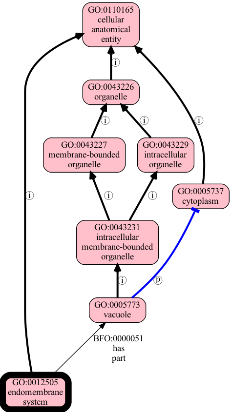
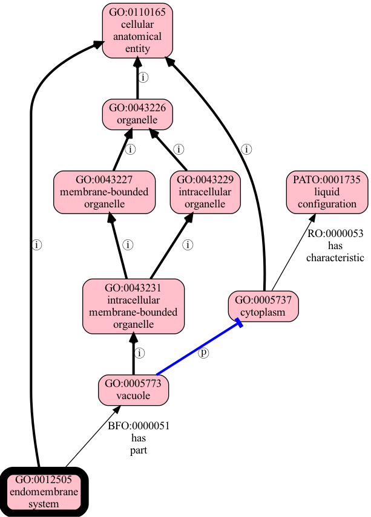
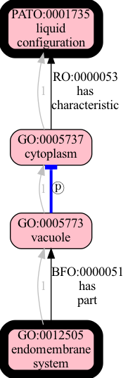

.. _relationships_and_graphs:

Relationships and Graphs
========================

One of the main uses of an ontology is to precisely state the :term:`Relationships<Relationship>` between different entities or concepts.

In OAK, classes in ontologies can be related to one another via different *relationship types*, also known as :term:`Predicates<Predicate>`. These
may come from a relationship type ontology such as :term:`RO`, or they may be a "built-in" construct in :term:`RDF` or :term:`OWL`
such as ``rdfs:subClassOf``.

These can be thought of as a :term:`Graph` of concepts and relationships. This is a common idiom
for bioinformatics users of ontologies - but, perhaps surprisingly, graphs do not
feature heavily in Description Logic formalisms of ontologies like :term:`OWL`.

Instead there exist a number of different :term:`Ontology Graph Projection` methods that
project from OWL to a graph. The fact there is no one standard method can lead to confusion.

But let's start with a standard bio-ontology example - the :term:`UBERON` ontology.

Exploring relationships
------------------------

Let's explore Uberon, looking at the relationships for *hand* ("manus") and *foot* ("pes"),
which have respective CURIEs `UBERON:0002398 <http://purl.obolibrary.org/obo/UBERON_0002398>`_
and `UBERON:0002387 <http://purl.obolibrary.org/obo/UBERON_0002387>`_.

We will use the ``relationships`` method from :ref:`basic_ontology_interface`.

.. code-block:: python

    >>> from oaklib import get_adapter
    >>> adapter = get_adapter("sqlite:obo:uberon")
    >>> for rel in adapter.relationships(["UBERON:0002398", "UBERON:0002387"]):
    ...    print(rel)
    ('UBERON:0002387', 'BFO:0000050', 'UBERON:0002103')
    ('UBERON:0002387', 'RO:0002202', 'UBERON:0006871')
    ('UBERON:0002387', 'RO:0002551', 'UBERON:0001445')
    ('UBERON:0002387', 'rdfs:subClassOf', 'UBERON:0002470')
    ('UBERON:0002387', 'rdfs:subClassOf', 'UBERON:0008784')
    ('UBERON:0002398', 'BFO:0000050', 'UBERON:0002102')
    ('UBERON:0002398', 'RO:0002202', 'UBERON:0006875')
    ('UBERON:0002398', 'RO:0002551', 'UBERON:0001442')
    ('UBERON:0002398', 'rdfs:subClassOf', 'UBERON:0002470')
    ('UBERON:0002398', 'rdfs:subClassOf', 'UBERON:0008785')

Each line is Relationship *tuple*, ``(SUBJECT, PREDICATE, OBJECT)``.

We can make this more human readable:

.. code-block:: python

    >>> for s, p, o in adapter.relationships(["UBERON:0002398", "UBERON:0002387"]):
    ...    print((adapter.label(s), adapter.label(p), adapter.label(o)))
    ('pes', 'part of', 'hindlimb')
    ('pes', 'develops from', 'embryonic footplate')
    ('pes', 'has skeleton', 'skeleton of pes')
    ('pes', None, 'autopod region')
    ('pes', None, 'lower limb segment')
    ('manus', 'part of', 'forelimb')
    ('manus', 'develops from', 'embryonic handplate')
    ('manus', 'has skeleton', 'skeleton of manus')
    ('manus', None, 'autopod region')
    ('manus', None, 'upper limb segment')

(note subClassOf / :term:`IS_A` labels are outside the ontology so they have no labels)

.. note ::

    if you are used to working with OWL and the underlying RDF/OWL representation
    the presentation as simple triads above can be confusing, as these are not actually
    modeled as triples in the ontology, but rather as more complex axioms involving
    constructs like existential restriction. These axioms are *projected* onto a graph
    representation. We will return to this topic later.

Graph Traversal and Relation Graph Reasoning
--------------------------------------------

The above examples show :term:`Asserted` Relationships between concepts. A common
use case for ontologies is exploring *indirect* or :term:`Entailed` Relationships,
which roughly corresponds to the concept of :term:`Ancestor` in a graph.

We will use the ``ancestors`` method from :ref:`basic_ontology_interface`.

.. code-block:: python

    >>> from oaklib.selector import get_adapter
    >>> from oaklib.datamodels.vocabulary import IS_A, PART_OF
    >>> adapter = get_adapter("sqlite:obo:uberon")
    >>> for anc in sorted(adapter.ancestors("UBERON:0002398", predicates=[IS_A, PART_OF])):
    ...    print(f"{anc} '{adapter.label(anc)}'")
    BFO:0000001 'entity'
    BFO:0000002 'continuant'
    BFO:0000004 'independent continuant'
    BFO:0000040 'material entity'
    ...
    UBERON:0000026 'appendage'
    UBERON:0000061 'anatomical structure'
    UBERON:0000153 'anterior region of body'
    UBERON:0000465 'material anatomical entity'
    UBERON:0000468 'multicellular organism'
    UBERON:0000475 'organism subdivision'
    UBERON:0001062 'anatomical entity'
    UBERON:0002101 'limb'
    ...

Graph Traversal Strategies
~~~~~~~~~~~~~~~~~~~~~~~~~~

There are actually *two* strategies for getting indirect relationships in OAK:

- HOP, aka :term:`Graph Traversal`
- ENTAILMENT, aka :term:`Reasoning`

You can specify which you would like, but if you leave this open the adapter will choose a
default. Not all adapters can implement both strategies.

What are the differences? In many cases the results are the same, but formally the differences are:

- HOP yields all nodes that can be traversed via zero or more hops from the specified starting point(s),
  over the specified relationships
- ENTAILMENT uses deductive reasoning to compute inferred relationships, and yields any relationships
  whose entailed predicate matches the input list

Currently the following OAK adapters incorporate entailment:

- :ref:`ubergraph_implementation`
- :ref:`sql_implementation`

In both cases the entailment is done ahead of time using :term:`Relation Graph` to compute the
entailed edges.

.. note::

    We have experimental support for entailment with other adapters, this requires
    having ``relation-graph`` on the command line.

Examples of where entailment yields more
~~~~~~~~~~~~~~~~~~~~~~~~~~~~~~~~~~~~~~~~

Assuming we have edges:

- A has-part B (in OWL: A SubClassOf has-part some B)
- B part-of C (in OWL: B SubClassOf part-of some C)

And additionally, the ontology contains a :term:`Property Chain` axiom:

- ``has-part o part-of -> overlaps``

Then using the entailment strategy we get an entailed edge:

- A overlaps C (in OWL: A SubClassOf overlaps some C)

Using graph traversal will tell us that there is at least one path between A and B,
and that this path involves hoping over two predicates, but it doesn't give us
*precise* information about the relationship between A and C.

Furthermore, if we use graph traversal and don't filter over predicates, then
we may end up with lots of essentially meaningless paths, especially if the ontology
makes use of extensive relationships from an ontology like RO.

Let's make this more concrete with a subset of an actual ontology:

.. code-block:: yaml

    [Term]
    id: GO:0012505
    name: endomembrane system
    is_a: GO:0110165 ! cellular anatomical entity
    relationship: has_part GO:0005773 ! vacuole

    [Term]
    id: GO:0005773
    name: vacuole
    is_a: GO:0043231 ! intracellular membrane-bounded organelle
    relationship: part_of GO:0005737 ! cytoplasm

    [Term]
    id: GO:0043227
    name: membrane-bounded organelle
    is_a: GO:0043226 ! organelle

    [Term]
    id: GO:0043229
    name: intracellular organelle
    is_a: GO:0043226 ! organelle

    [Term]
    id: GO:0043231
    name: intracellular membrane-bounded organelle
    is_a: GO:0043227 ! membrane-bounded organelle
    is_a: GO:0043229 ! intracellular organelle

    [Term]
    id: GO:0043226
    name: organelle
    is_a: GO:0110165 ! cellular anatomical entity

    [Term]
    id: GO:0005737
    name: cytoplasm
    is_a: GO:0110165 ! cellular anatomical entity

    [Term]
    id: GO:0110165
    name: cellular anatomical entity

    [Typedef]
    id: part_of
    name: part of
    xref: BFO:0000050
    is_transitive: true
    is_a: overlaps

    [Typedef]
    id: has_part
    name: has part
    xref: BFO:0000051
    inverse_of: part_of
    is_a: overlaps

    [Typedef]
    id: overlaps
    name: overlaps
    xref: RO:0002131
    holds_over_chain: has_part part_of

We use :term:`OBO Format` for compactness here, but the same thing that can be done in
OWL. Note the ``holds_over_chain`` axiom, which is a :term:`Property Chain` axiom.

The ontology can be visualized:

   Example sub-ontology focused on the endomembrane system (GO:0012505).
   This is a simplified subset of GO for demo purposes. Figure generated using
   ``runoak viz -i tests/input/entailment-tutorial.obo "endomembrane system"``

Let's load up the ontology:

    >>> adapter = get_adapter("simpleobo:tests/input/entailment-tutorial.obo")

Now let's use the default graph traversal to get the ancestors of ``GO:0012505`` *endomembrane system*:

    >>> len(list(adapter.ancestors("GO:0012505")))
    8

This is all the nodes in the graph (including the query node itself, as operations
are by default :term:`Reflexive`).

Now let's use the entailment strategy to get :term:`Entailed` ancestors:

    >>> from oaklib.interfaces.obograph_interface import GraphTraversalMethod
    >>> len(list(adapter.ancestors("GO:0012505", method=GraphTraversalMethod.ENTAILMENT)))
    8

Identical results! (Later on we will use an example where the results are different).

One advantage of the entailment strategy is that we can see the inferred
relationship between any term pair. To do this, we use the ``relationships``
method in :ref:`basic_ontology_interface`:

    >>> for _, p, o in sorted(adapter.relationships(["GO:0012505"],
    ...                                         include_entailed=True)):
    ...     print(p, o, adapter.label(o))
    BFO:0000051 GO:0005773 vacuole
    BFO:0000051 GO:0043226 organelle
    BFO:0000051 GO:0043227 membrane-bounded organelle
    BFO:0000051 GO:0043229 intracellular organelle
    BFO:0000051 GO:0043231 intracellular membrane-bounded organelle
    BFO:0000051 GO:0110165 cellular anatomical entity
    RO:0002131 GO:0005737 cytoplasm
    RO:0002131 GO:0005773 vacuole
    RO:0002131 GO:0043226 organelle
    RO:0002131 GO:0043227 membrane-bounded organelle
    RO:0002131 GO:0043229 intracellular organelle
    RO:0002131 GO:0043231 intracellular membrane-bounded organelle
    RO:0002131 GO:0110165 cellular anatomical entity
    rdfs:subClassOf GO:0012505 endomembrane system
    rdfs:subClassOf GO:0110165 cellular anatomical entity

No equivalent operation exists for graph traversal.

However, it is possible to use the ``paths`` method to see all paths, e.g. between
endomembrane system and cytoplasm:

    >>> for _s, _e, node in sorted(adapter.paths(["GO:0012505"],
    ...                                          directed=True,
    ...                                          target_curies=["GO:0005737"])):
    ...     print(node)
    GO:0005737
    GO:0005773
    GO:0012505

This is the list of intermediate nodes.

We can also see a difference if we restrict the graph traversal to specified
predicates, e.g. has-part (BFO:0000051):

With the default method:

    >>> for a in sorted(adapter.ancestors("GO:0012505",
    ...                                   predicates=["BFO:0000051"],
    ...                                   method=GraphTraversalMethod.HOP)):
    ...     print(a, adapter.label(a))
    GO:0005773 vacuole
    GO:0012505 endomembrane system

Here the ancestors method is walking the graph, and performing
a direct filter on edges.

With entailment

    >>> for a in sorted(adapter.ancestors("GO:0012505",
    ...                                   predicates=["BFO:0000051"],
    ...                                   method=GraphTraversalMethod.ENTAILMENT)):
    ...     print(a, adapter.label(a))
    GO:0005773 vacuole
    GO:0043226 organelle
    GO:0043227 membrane-bounded organelle
    GO:0043229 intracellular organelle
    GO:0043231 intracellular membrane-bounded organelle
    GO:0110165 cellular anatomical entity

Here the entailment strategy yields all ancestors *A* such that the
axiom "endomembrane system SubClassOf has-part some *A*" is true.

This difference is further marked when we query using the overlaps (RO:0002131) relation. Note
this is not :term:`Asserted` in the sample ontology.

    >>> list(adapter.ancestors("GO:0012505",
    ...                        predicates=["RO:0002131"],
    ...                        reflexive=False,
    ...                        method=GraphTraversalMethod.HOP))
    []

But if we ask the same question using the entailment strategy, we
get everything that overlaps with the endomembrane system:

    >>> for a in sorted(adapter.ancestors("GO:0012505",
    ...                                   predicates=["RO:0002131"],
    ...                                   reflexive=False,
    ...                                   method=GraphTraversalMethod.ENTAILMENT)):
    ...     print(a, adapter.label(a))
    GO:0005737 cytoplasm
    GO:0005773 vacuole
    GO:0043226 organelle
    GO:0043227 membrane-bounded organelle
    GO:0043229 intracellular organelle
    GO:0043231 intracellular membrane-bounded organelle
    GO:0110165 cellular anatomical entity

Examples of where graph traversal yields more ancestors than entailment
~~~~~~~~~~~~~~~~~~~~~~~~~~~~~~~~~~~~~~~~~~~~~~~~~~~~~~~~~~~~~~~~~~~~~~

Let's extend our ontology by adding an additional edge:

- cytoplasm has-characteristic liquid (PATO:0001735)

Our ontology now looks like:

   This extends the previous figure by the addition of a new edge
   with a new predicate (has-characteristic).
   Figure generated using ``runoak viz -i tests/input/entailment-tutorial-2.obo``

Let's load up the 2nd ontology:

    >>> adapter = get_adapter("simpleobo:tests/input/entailment-tutorial-2.obo")

Let's compare the results of the two strategies, without filtering for predicates:

    >>> hop_ancs = list(adapter.ancestors("GO:0012505",
    ...                                   method=GraphTraversalMethod.HOP))
    >>> ent_ancs = list(adapter.ancestors("GO:0012505",
    ...                                   method=GraphTraversalMethod.ENTAILMENT))
    >>> len(hop_ancs), len(ent_ancs)
    (9, 8)

This time the HOP strategy gives us one additional ancestor. We can see which one:

    >>> set(hop_ancs) - set(ent_ancs)
    {'PATO:0001735'}

   Figure generated using ``runoak   --stacktrace  -i tests/input/entailment-tutorial-2.obo paths "endomembrane system" @ PATO:0001735  --viz --directed --include-predicates``

On the one hand this increased recall can be seen as an advantage of HOPping over
a graph. On the other, the relationship between endomembrane system and liquid is not
particularly *meaningful*, and may even be misleading (the endomembrane system is not
itself liquid). If we decided that there is a meaningful named relation we want to use,
then we can name it and define it with a property chain, and add it. E.g.

- ``has_part_with_characteristic <- has-part o has-characteristic``

But this would be a fairly odd predicate with many entailed edges (e.g. a human body
would stand in this relationship type to just about every property imaginable, e.g
charges of all chemicals, morphologies of all cells, ...).

On the other hand there are cases where the ontology developers have not anticipated
all possible property chains, and in these cases the graph traversal strategy may yield
potentially useful results.

Which strategy should I use?
~~~~~~~~~~~~~~~~~~~~~~~~~~~~

The entailment strategy will give you more *precise*, *meaningful* results, but it
may miss entailed edges you care about, especially if the ontology you are using
does not make extensive use of property chains.

The graph traversal strategy will give you more *complete* results, the resulting
paths may be meaningless, especially if you don't constrain the predicates.

A note on entailed direct edges
~~~~~~~~~~~~~~~~~~~~~~~~~~~~~~~

.. note::

    This is a fairly advanced topic that isn't necessary for working with most
    ontologies.

Readers who are coming from an advanced OWL background may at this point be wondering
why we don't mention another category of entailed edges, specifically :term:`Direct` edges
that are entailed, but not :term:`Asserted`.

For example, if we have an ontology with edges:

- MesentericVein drains SmallIntestine (or in OWL: MesentericVein SubClassOf drains some SmallIntestine)
- drains Domain Vein

Then OWL entailment will yield an edge:

- MesentericVein rdfs:subClassOf Vein

This *may* be a direct edge (if there is not a more specific vein classification),
and in principle it *may* be the case that this is not asserted

However, OAK is designed for working with *released* versions of ontologies,
which should be *pre-classified*. This means that all edges that are both :term:`Direct`
and :term:`Entailed` should also be :term:`Asserted`.

Further notes on OWL and Graph Projection
-----------------------------------------

Many ontologies use the OWL language to express relationships between entities. The OWL
representation is not directly a graph, but different kinds of OWL axioms can be *projected*
onto graph edges. This kind of projection is common, but lacks standardization.

Two of the most common patterns in OWL ontologies are:

- SubClassOf between two named classes (e.g. Finger SubClassOf Digit)
- SubClassOf between a named class and a simple existential restriction (e.g. Digit SubClassOf part-of some Hand)

It's a de-facto standard that these are both projected to graph edges (the former to an is-a or SubClassOf edge,
the latter to a part-of edge). This can be seen e.g. in ontology browsers such as the OLS. These two kinds of
axioms are very common in bio-ontologies. However, there is a lack of standardization in how more complex axioms
should be mapped to edges, or whether they should be.

The following table outlines some common patterns and whether these are projected to edges in common tools:

.. csv-table:: OWL to Graph Projections
   :header: OWL Axiom, Graph Projection, SQL Adapter, Relation Graph
   :widths: 20, 20, 20, 20

    A SubClassOf B, rdfs:subClassOf B, Yes, Yes
    A SubClassOf R some B, A R B, Yes, Yes
    A SubClassOf R value B, A R B, Yes, No
    A SubClassOf R only B, A R B, No, No
    A SubClassOf R max 0 B, A R B, No, No
    I type A, I rdf:type A, Yes, No
    I type R some A, I R A, Yes, No
    I type R value A, I R A, Yes, No
    I Facts: R J, I R J, Yes, No

See `OWLStar <https://github.com/linkml/owlstar>`_ for progress towards a standardization of OWL
graph projections for property graphs - this also includes proposals for labeling edges with axiom
types as well as additional semantic information (e.g. cardinality) and annotations.
