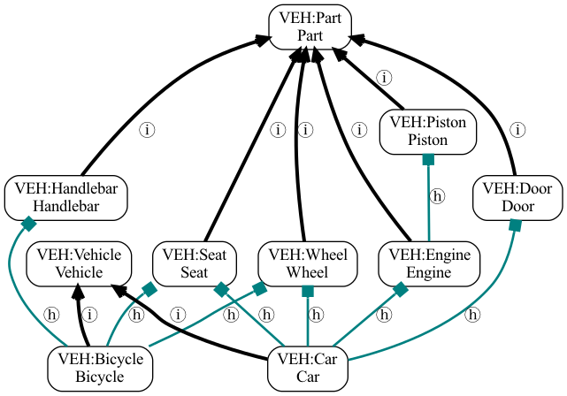
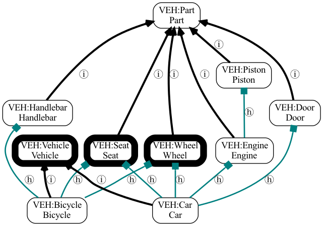

.. _similarity:

Computing Similarity between Entities
====================================

Background
----------

A common use case for ontologies is to compute :term:`Similarity` between :term:`Entities <Entity>`,
or between :term:`Terms <Term>`, based on properties of the ontology. For example,
when comparing two terms, we may want to score terms that are closer together in the ontology
:term:`Graph` as more similar. Other measures of similarity may be on frequency of usage of terms,

If :term:`Entities <Entity>` are annotated/associated with terms, we can also compute similarity
between these based on the aggregate set of terms they are annotated with. The canonical use
case for OAK here is :term:`Gene` associations (e.g. to phenotypes, GO terms, anatomy or cell
types for expression, etc), although any entities can be compared if ontology associations exist
(e.g. comparing two people basic on shared music genres or favorite foods).

OAK provides various methods for computing similarity of terms and entities. These are currently
focused on "classic" semantic similarity measures, such as Jaccard similarity and information-content
based measures, but this may be extended in the future to support newer embedding-based methods.

Like all aspects of OAK, there is a separation between :term:`Interface` and :term:`Implementation`.
The :ref:`semantic similarity interface <semantic_similarity_interface>` defines the API for computing similarity
and related metrics. In theory there can be many implementations of this interface, in practice there
is a default implementation and the semsimian implementation. See later in this document on for details.

Concepts
--------

Jaccard Similarity
^^^^^^^^^^^^^^^^^^^

Jaccard similarity (`Wikipedia <https://en.wikipedia.org/wiki/Jaccard_index>`_) is a measure of similarity
between two sets:

.. math::

    J(A,B) = \frac{|A \cap B|}{|A \cup B|}

where :math:`A` and :math:`B` are sets.

For example given two sets ``{banana, apple, orange}`` and ``{apple, orange, pear}``, the intersection of these
two sets is ``{apple, orange}`` (size 2) and the union is ``{banana, apple, orange, pear}`` (size 4). The Jaccard similarity
is therefore:

.. math::

    J = \frac{2}{4} = 0.5

Jaccard Similarity of ontology terms
^^^^^^^^^^^^^^^^^^^^^^^^^^^^^^^^^^^^

When applied to pairs of ontology :term:`Terms <Term>`, the sets are typically the :term:`Reflexive` :term:`Ancestors<Ancestor>`
of the terms of interest. Like all OAK graph operations, the choice of :term:`Predicates<Predicate>` used is
important.

- Phenotype ontologies typically compute this using :term:`SubClassOf` links only
- Ontologies such as GO, Uberon, and ENVO typically use :term:`SubClassOf` and :term:`PartOf` links

For example, given an ontology of vehicles with the following structure:

.. code-block:: none

    Car is-a Vehicle
    Car has-part Engine is_a Part
    Car has-part Wheel is_a Part
    Car has-part Door is_a Part
    Engine has-part Piston is_a Part
    Car has-part Seat is_a Part
    Bicycle is-a Vehicle
    Bicycle has-part Wheel is_a Part
    Bicycle has-part Handlebar is_a Part
    Bicycle has-part Seat is_a Part

Visualized as:

   Vehicle ontology

If we follow predicates ``{is-a, has-part}`` (both of which are reflexive), then we have reflexive ancestors:

- Car: {Car, Vehicle, Engine, Wheel, Door, Piston, Seat, Part}
- Bicycle: {Bicycle, Vehicle, Wheel, Handlebar, Seat, Part}

- Intersection: {Vehicle, Wheel, Seat, Part}
- Union: {Car, Vehicle, Engine, Wheel, Door, Piston, Seat, Bicycle, Handlebar, Part}

The same ontology with the :term:`Most Recent Common Ancestor` terms of Car and Bicycle highlighted:

   Vehicle ontology with MRCAs

Jaccard similarity between Car and Bicycle would be:

.. math::

    J = \frac{4}{10} = 0.4

You can test this by running:

.. code-block:: bash

    runoak -i simpleobo:tests/input/vehicles.obo similarity Car @ Bicycle

Information Content
^^^^^^^^^^^^^^^^^^^

Information Content (IC) is a measure of the specificity of a term. It is typically computed as the log of
the inverse of the frequency of the term in a corpus:

.. math::

    IC(t) = -log(P(t))

where :math:`P(t)` is the probability of the term in the corpus. There are two ways to compute this:

- Using the ontology as the corpus
- Using :term:`Associations <Association>` between entities and terms as the corpus

In both cases the whole ontology :term:`Graph` is used. This means that a :term:`Descendant` term
will always have IC that is equal to or greater than its :term:`Ancestor` term (over some specified
set of predicates).

When the ontology is used as the corpus, the probability of a term is computed as the number of
descendants of a term (reflexive) divided by the total number of terms in the ontology:

.. math::

    P(t) = \frac{|Desc*(t)|}{|T|}

You can see this via

.. code-block:: bash

    runoak -i simpleobo:tests/input/vehicles.obo similarity Car @ Bicycle

When we consider all relationships, there are multiple MRCAs (see figure above). These are tied with an IC of 1.29.

When associations are used, the probability of a term is computed as the number of entities
associated with a term (directly or indirectly) divided by the total number of entities:

.. math::

    P(t) = \frac{|E(t)|}{|E|}

where :math:`E(t)` is the set of entities associated with :math:`t` and :math:`E` is the set of all entities.

To build a table of IC for all terms in HPO, using the ontology as the corpus:

.. code-block:: bash

    runoak -i sqlite:obo:hp information-content -p i i^HP:

To include associations, use the ``--use-associations`` flag, in addition to
specifying the associations themselves:

.. code-block:: bash

    runoak  -g phenotype.hpoa -G hpoa -i sqlite:obo:hp information-content -p i --use-associations i^HP: -o hp.ics.tsv

Here we save to a file ``hp.ics.tsv``

IC can be used to score the :term:`Most Recent Common Ancestor` (MRCAs) of two terms; also known
as Resnik similarity.

We can compare scores using native ontology ICs and ICs using annotations as a corpus

.. code-block:: bash

    runoak -i sqlite:obo:hp similarity -p i HP:0000015 @ HP:0000017

Gives an IC of 9.02 for the MRCA of Bladder diverticulum and Nocturia.

.. code-block:: yaml

    subject_id: HP:0000015
    subject_label: Bladder diverticulum
    object_id: HP:0000017
    object_label: Nocturia
    ancestor_id: HP:0000014
    ancestor_label: Abnormality of the bladder
    ancestor_information_content: 9.020517017340513
    jaccard_similarity: 0.6
    phenodigm_score: 2.3264372354319613

We can plug in the association corpus based IC table using the ``--information-content-file`` option:

.. code-block:: bash

    runoak -i sqlite:obo:hp similarity -p i --information-content-file hp.ics.tsv HP:0000015 @ HP:0000017

This will give a lower IC:

.. code-block:: yaml

    subject_id: HP:0000015
    subject_label: Bladder diverticulum
    object_id: HP:0000017
    object_label: Nocturia
    ancestor_id: HP:0000014
    ancestor_label: Abnormality of the bladder
    ancestor_information_content: 3.042673785507031
    jaccard_similarity: 0.6
    phenodigm_score: 1.3511492409442485

The higher IC for pure ontology corpus reflects a bias in depth in the ontology.

Ensemble Scoring of term pairs
^^^^^^^^^^^^^^^^^^^^^^^^^^^^^^

We can compute ensemble scores by combining existing scores. For example, the **Phenodigm score** combines
Jaccard similarity and Resnik similarity.

See the `Phenodigm paper <https://pubmed.ncbi.nlm.nih.gov/23660285/>`_ for details.

Other similarity measures
^^^^^^^^^^^^^^^^^^^^^^^^^

Other potential similarity measures include:

- Phenologs
- Embedding-based methods

    * KGE embeddings, e.g. GRAPE
    * Text embeddings, e.g. using OpenAI text-ada-002

Aggregate measures for comparing entities
^^^^^^^^^^^^^^^^^^^^^^^^^^^^^^^^^^^^^^^^

Computing similarity between terms (classes) is relatively easy. But in general, users want to compare
*entities* such as genes. Here we have two broad approaches:

- Knowledge Graph (KG): treat the **entities as nodes/terms in the graph** and use the standard ontology methods above
- Aggregate Statistics (e.g. Best Match Average)

With the KG approach the entities typically become leaf nodes in the graph, and we compare using standard
graph methods where both association predicates (e.g. has-phenotype) and ontology predicates (e.g. is-a and part-of)
are used.

The more common approach is to use aggregate statistics, which better accounts for incomplete annotation and
annotation bias. Here we have two entities to compare e1 and e2, where each entity is the subject
of association edges pointing to terms (sometimes called a *profile*). The goal is to compare the profiles
using aggregate statistics. The aggregate statistics can be performed over any individual pairwise term
statistics.

The simplest approach is to take the maximum pairwise similarity between terms in the two profiles;
for the IC of the MRCA this would be:

.. math::

    max_{t1 \in e1, t2 \in e2} IC(MRCA(t1,t2))

However, this doesn't take into account all the other associations for each entity.

A more common aggregate statistic is **Best Match Average** (BMA), which is the average of the maximum
pairwise similarity between each term in the first profile and the second profile:

.. math::

    BMA(e1,e2) = \frac{1}{|e1|} \sum_{t1 \in e1} max_{t2 \in e2} IC(MRCA(t1,t2))

Currently this is the default used in OAK.

This is illustrated in this figure:

.. figure:: https://www.ncbi.nlm.nih.gov/pmc/articles/instance/3649640/bin/bat025f1p.jpg
   :alt:

   Aggregate statistics, from the Phenodigm paper.

To compare two profiles in OAK you can use the ``termset-similarity`` command, passing in each
profile, separated by ``@``:

.. code-block:: bash

    runoak -i sqlite:obo:mp termset-similarity \
       MP:0010771 MP:0002169 MP:0005391 MP:0005389 MP:0005367 @\
       MP:0010771 MP:0002169 MP:0005391 MP:0005389 MP:0005367

(note that like all OAK commands, any expression can be substituted as arguments, e.g. ``.idfile`` to
load the IDs from a file)

The result conforms to `TermSetPairwiseSimilarity <https://w3id.org/linkml/similarity/TermSetPairwiseSimilarity>`_

This assumes that you have already done the lookup using an association table.

Note that in the above, the IC scores are calculated using only the ontology as corpus.
You can pass in a pre-generated IC table (e.g. if you computed this using a particular association database)
using the ``--information-content-file`` option.

Vector-based approaches
^^^^^^^^^^^^^^^^^^^^^^

The methods above are formulated in terms of *sets* of ontology terms.

A term can also be conceived of as a *vector*. The simplest representation is a one-hot vector for each term,
with a bit set for every ancestor of that term. Entities can also be conceived of as vectors of their profile
and all ancestors of that profile.

With a vector representation, vector-based methods such as cosine similarity can be used, including
cosine-similarity. These are typically faster to compute, and libraries such as numpy can be used to
efficiently compute all-by-all similarities.

Typically one-hot encodings are long, if the ontology is large (one element per term). More recent
methods make use of *reduced dimensionality vectors*. These might be computed from the graph
(either pure ontology graph, or the KG formed by combining associations and ontology graph), or from
textual descriptions of the terms using text embedding models.

Currently OAK does not support these reduced dimensionality vectors, for now you can use libraries
such as

- `GRAPE <https://github.com/AnacletoLAB/grape>`_ for KG embedding and ML
- `CurateGPT <https://github.com/monarch-initiative/curate-gpt>`_ for operations using text embeddings
  over ontologies.

Implementations
---------------

Default Implementation
^^^^^^^^^^^^^^^^^^^^^

Currently the default implementation in OAK is in pure python, and may be slow for
large ontologies or association databases.

Ubergraph
^^^^^^^^^

Ubergraph has ICs pre-computed, using multiple ontologies as a corpus.

Semsimian
^^^^^^^^^

`Semsimian <https://github.com/monarch-initiative/semsimian>`_ is a Rust implementation of
semantic similarity. OAK is able to use this as an implementation, *wrapping* an existing
implementation.

To wrap an existing adapter using semsimian, prefix the selector with ``semsimian:``

For example:

.. code-block:: bash

    runoak -i semsimian:sqlite:obo:hp similarity .all @ .all -O csv

Note that semsimian is under active development and performance characteristics may change.

Data Model
~~~~~~~~~~

See the `Similarity data model <https://w3id.org/oak/similarity/>`_ for details of the data model.

Companion Notebooks
-------------------

See the notebook for the `termset-similarity Command <https://github.com/INCATools/ontology-access-kit/blob/main/docs/examples/Commands/TermsetSimilarity.ipynb`_

Further reading
---------------

- Lord et al, Semantic similarity measures as tools for exploring the gene ontology https://pubmed.ncbi.nlm.nih.gov/12603061/
- Koehler et al, Clinical diagnostics in human genetics with semantic similarity searches in ontologies, https://pubmed.ncbi.nlm.nih.gov/19800049/